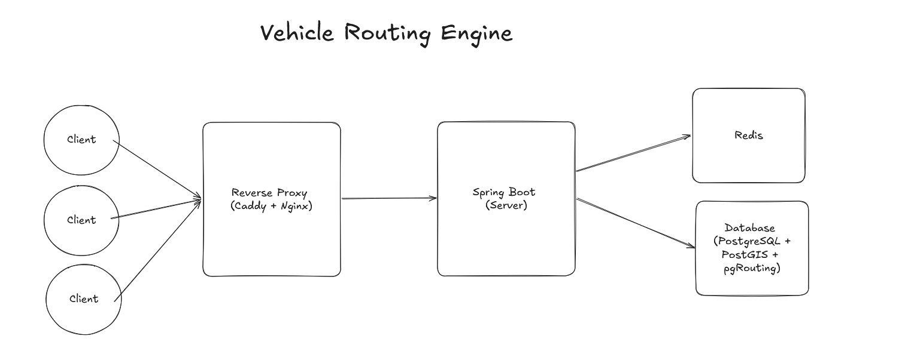

# GeoRoute

A self-hosted vehicle routing engine built on **OpenStreetMap** data. Routes are computed with **A\* pathfinding** in PostgreSQL via pgRouting and PostGIS over a **1.8M-segment road graph of New York State** — no third-party routing APIs. Every route comes back with turn-by-turn directions, one-way street handling, and travel-time costs per road type. Repeated routes are served from a Redis cache in milliseconds.

## Architecture




## Tech stack

| Layer | Technology |
|---|---|
| Backend | Spring Boot |
| Frontend | React, Leaflet |
| Database | PostgreSQL, PostGIS, pgRouting |
| Cache | Redis  |
| Map data | OpenStreetMap via osm2pgsql |
| Proxy / TLS | Caddy, nginx |
| Load testing | k6 |

## API

| Endpoint | Purpose |
|---|---|
| `POST /api/route` | Route between `source` and `destination` (`{lat, lon}` each, within New York State). Returns geometry, turn-by-turn steps, total distance and duration. |

## Running locally

Requires Docker with Compose and an OSM extract at `data/region.osm.pbf` (e.g. New York from [Geofabrik](https://download.geofabrik.de/)). Create `backend/.env`:

```properties
POSTGRES_USER=georoutemaps
POSTGRES_PASSWORD=<any password>
POSTGRES_DB=routing_db
```

Start the stack, then import the map and build the routing graph (one-time, persisted in the `postgres-data` volume):

```bash
docker compose up -d --build
docker compose --profile routing-import up osm-routing-import
docker compose exec -T postgres sh -c 'psql -U "$POSTGRES_USER" -d "$POSTGRES_DB"' < backend/db/setup_routing.sql
docker compose exec -T postgres sh -c 'psql -U "$POSTGRES_USER" -d "$POSTGRES_DB"' < backend/db/car_graph.sql
```

The app is at **http://localhost**. For production, set `SITE_ADDRESS=yourdomain.com` in a root `.env` and `CORS_ALLOWED_ORIGINS` in `backend/.env`.


## Notes

- **An `.osm.pbf` file must be provided for the import command to work.** It isn't included in the repo (`data/` is gitignored), so download an extract (e.g. [New York from Geofabrik](https://download.geofabrik.de/north-america/us/new-york.html)) and save it as `data/region.osm.pbf` *before* running `osm-routing-import`. If the file is missing, Docker mounts an empty directory in its place and the import fails.

## Next Steps

- Eliminate the need for third-party API responsible for converting natural language source & destination to latitude & longitude coordinates 
